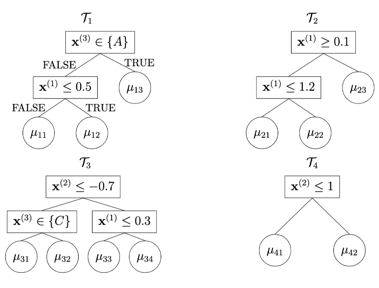
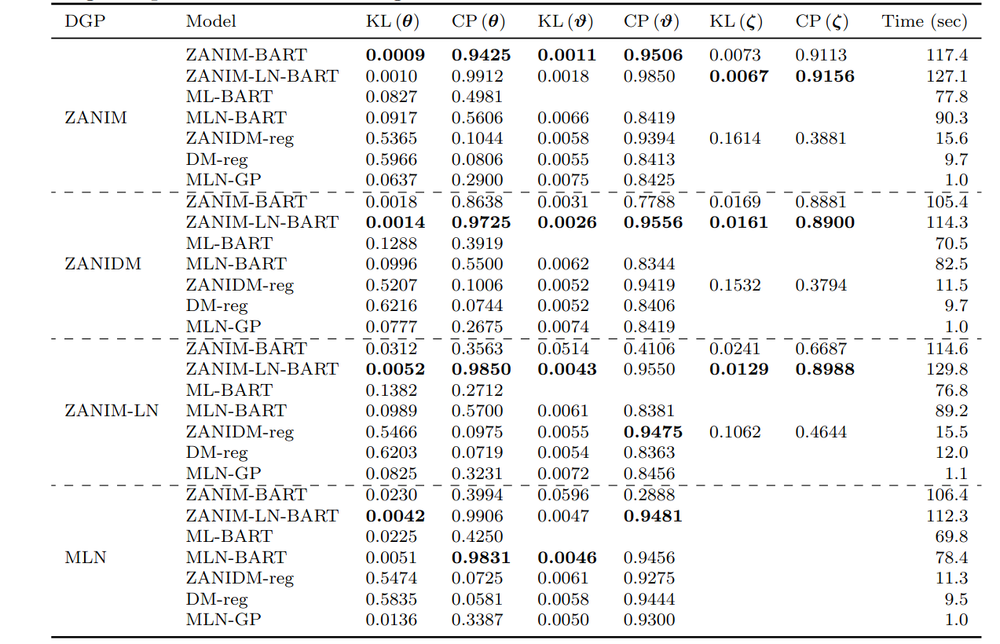
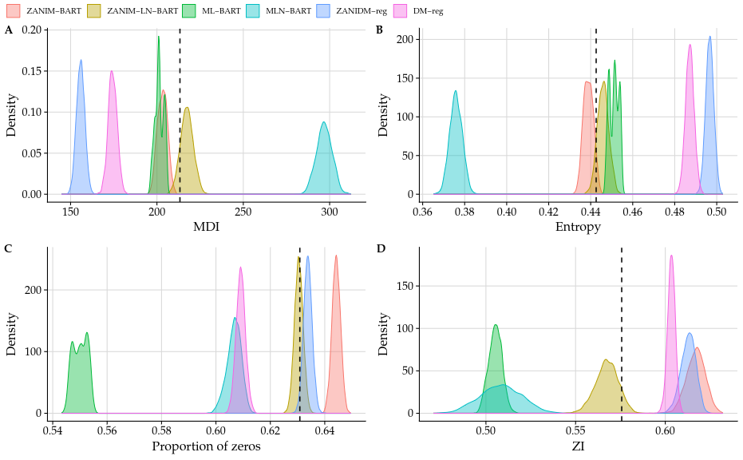
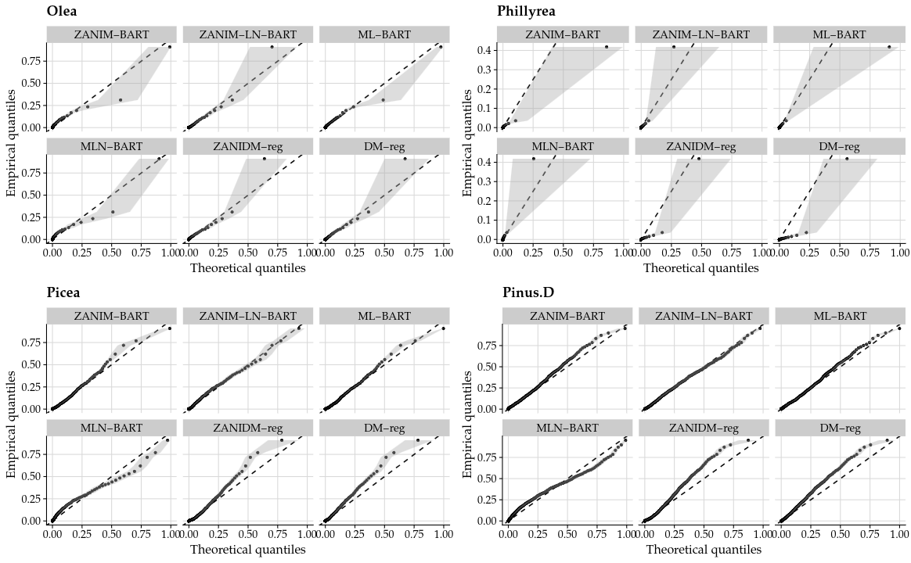
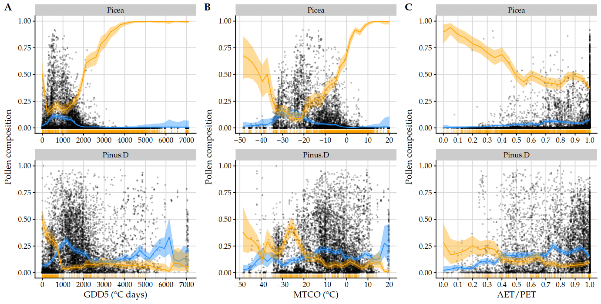
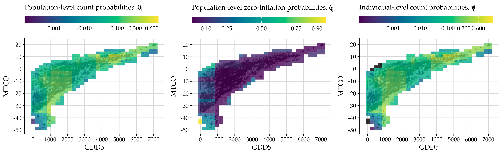
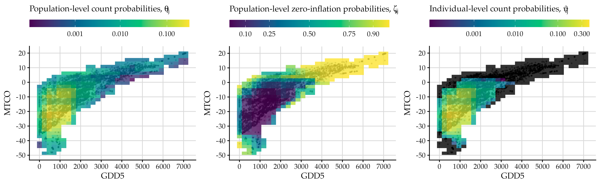

```{r setup, include=FALSE}
knitr::opts_chunk$set(echo = FALSE, fig.align = "center",
                      dev = "svg", fig.width = 10, fig.height = 6)
library(RefManageR)
library(ggplot2)
library(cowplot)
library(xtable)
library(dplyr)
theme_set(
  theme_cowplot(font_size = 16, font_family = "Palatino") +
    background_grid() +
    theme(legend.position = "top")
)
options(digits = 4L)

BibOptions(check.entries = FALSE, bib.style = "authoryear", 
           cite.style = 'authoryear',
           style = "markdown",
           no.print.fields = c("doi", "issn", "urldate"),
           hyperlink = TRUE, dashed = TRUE, max.names = 1, longnamesfirst = FALSE)
bib <- ReadBib("./references.bib", check = FALSE)
data_pollen <- read.csv(file = file.path("./data", "rs11_pollen.csv"))
data_pollen <- dplyr::as_tibble(data_pollen)
sp <- c("Pinus.D", "Betula", "Gramineae", "Picea", "Quercus.D", "Alnus", "Cyperaceae",
        "Chenopodiaceae", "Artemisia", "Quercus.E", "Salix", "Juniperus", "Ericales",
        "Fagus", "Abies", "Olea", "Ulmus", "Corylus", "Ostrya", "Pinus.H", "Cedrus",
        "Carpinus", "Pistacia", "Castanea", "Larix", "Tilia", "Ephedra", "Phillyrea")
data_pollen$specie <- forcats::fct_relevel(data_pollen$specie, sp)
data_pollen

data_pollen_wide <- data_pollen |>
  dplyr::select(-c(category, prop)) |>
  dplyr::mutate(total = as.integer(total)) |>
  tidyr::pivot_wider(names_from = specie, values_from = total) 

```

# Outline

- Introduction

- Zero-inflation in count-compositional data

- The ZANIM-BART and ZANIM-LN-BART models

- Simulations

- Modern pollen-climate application

- Final remarks

---
# What is count-compositional data?

> Multivariate counts representing frequencies across mutually exclusive categories constrained by a total.

--

<!-- - The data are collected in a matrix $\mathbf{Y} \in \mathbb{N}_0^{n \times d}$, with $n$ samples and $j\in\{1,\ldots, d\}$ categories. -->

- $\mathbf{Y} = (Y_1, \ldots, Y_d)$ takes non-negative integer values defined in the discrete simplex space:

 $$\mathbb{S}_N^d = \left\{\mathbf{Y} \in (0,1,\ldots,N)^d; \sum_{j=1}^d Y_{j} = N\right\}.$$

--

- Applications:
  - Ecology `r Citep(bib, "Billheimer2001")`.
  - Palaeoclimate `r Citep(bib, "Vasko2000")`.
  - High-throughput sequencing experiments in biology, including microbiome
   `r Citep(bib, "Fernandes2014")` and single-cell `r Citep(bib, "Buttner2021")` studies.

---
## The underlying probability model

- Experiment: $N$ **independent** trials. Each trial results in one of the $d$ mutually exclusive categories.

- Let $E_j := ``\textrm{category } j \textrm{ occurs''}$ with probability $\Pr\lbrack E_j\rbrack = \theta_j$ for $j\in\{1, \ldots,d\}$. Note that $\Pr\left\lbrack \bigcup_{j=1}^d E_j\right\rbrack = \sum_{j=1}^d \Pr\lbrack E_j \rbrack = \sum_{j=1}^d \theta_j = 1$.

- Let $Y_j$ be a *random variable* denoting the **frequency** which category $j$ is observed over the $N$ independent trials. 
The joint probability $\{Y_1 = y_1, \ldots, Y_d = y_d\}$ is given by:

--

$$\Pr \lbrack \mathbf{Y} = \mathbf{y}; \boldsymbol{\theta} \rbrack = 
\binom{N}{y_{1} \dots y_{d}}\,\prod\limits_{j=1}^d\theta_j^{y_{j}}, \quad \mathbf{y} \in \mathbb{S}_N^d.$$

> The random vector $\mathbf{Y}=(Y_1, \ldots, Y_d)$ has a multinomial distribution: $$\mathbf{Y} \sim \operatorname{Multinomial}\lbrack N, \theta_1, \ldots, \theta_d \rbrack,$$ where $\boldsymbol{\theta}$ are the _population-level count(-compositional) probabilities_ with $\theta_j \in [0,1]$, $\sum_{j=1}^d \theta_j=1$.

---
## Challenges


- **Covariate effects**: understand how covariates are associated to $\boldsymbol{\theta}$.

- **Overdispersion**: variance larger than expected under the multinomial distribution.

- **Zero-inflation**: excess zeros relative to the multinomial distribution.

- **Complex dependence**: exhibit *positive* and negative correlation between the counts.

- **Latent heterogeneity**: unobserved structure across samples.

> Existing methods address some, but not all, of these challenges.


---
## Compound multinomial regression models

- Consider a random sample of size $n$ of $\mathbf{Y}_i$ count-compositional vectors
with observation-specific totals $N_i$.

  - Assume $(\mathbf{Y}_i \mid \boldsymbol{\theta}) \sim \operatorname{Multinomial}\lbrack N_i, \theta_1, \ldots, \theta_d \rbrack$.

  - Treat $\boldsymbol{\theta}=(\theta_1, \ldots, \theta_d)$ as a **random vector**. 
    - Dirichlet-multinomial (DM) model: $\boldsymbol{\theta} \sim \operatorname{Dirichlet}\lbrack \boldsymbol{\alpha}\rbrack$.
    - Multinomial logistic normal (MLN) model: $\boldsymbol{\theta} \sim \operatorname{LogisticNormal}\lbrack \boldsymbol{\mu}, \boldsymbol{\Sigma}\rbrack$.

--

- Given $\mathbf{x}_i = (x_{i1}, \ldots, x_{ip})$ sample-specific covariates, regression-based models usually relate $\mathbf{x}_i$ to each $\theta_j$ through a suitable link function with a **parametric linear functional form**.
  
  - multinomial logistic (ML) regression model:
  $\log \left( \theta_{ij} / g(\boldsymbol{\theta}) \right) = \mathbf{x}_i^\top \boldsymbol{\beta}_j$, for example, with $g(\boldsymbol{\theta})=\left(\prod_{k=1}^d \theta_{ik}\right)^{1/d}$.
  - DM log-linear regression model: $\log \alpha_{ij} = \mathbf{x}_i^\top \boldsymbol{\beta}_j$.


---
## Motivating applications

.font80[


```{r empirical-stats-datasets}
data("pollen_data", package = "zanicc")
# data("microbiome_data", package = "zanicc")
microbiome_data <- readRDS("./data/microbiome_gut.rds")
pollen_N <- rowSums(pollen_data$Y)
microbiome_N <- rowSums(microbiome_data$Y)
table_descr <- data.frame(Data = c("Pollen", "Microbiome"),
                          sample_size = c(nrow(pollen_data$Y), nrow(microbiome_data$Y)),
                          number_categories = c(ncol(pollen_data$Y), ncol(microbiome_data$Y)),
                          number_covariates = c(3L, ncol(microbiome_data$X_ffq)),
                          number_trials = c(paste0("[", min(pollen_N), ", ", max(pollen_N), "]"),
                                            paste0("[", min(microbiome_N), ", ", max(microbiome_N), "]")),
                          pct_zeros = 100*c(mean(pollen_data$Y == 0), mean(microbiome_data$Y == 0)),
                          ZI = c(zanicc::zi_multinomial(pollen_data$Y), zanicc::zi_multinomial(microbiome_data$Y)),
                          MDI = c(zanicc::mdi(pollen_data$Y), zanicc::mdi(microbiome_data$Y)), 
                          MCV = c(zanicc::mcv(pollen_data$Y), zanicc::mcv(microbiome_data$Y)))
colnames(table_descr) <- c("Data", "Sample size (\\(n\\))", "Number of categories (\\(d\\))",
                           "Number of covariates (\\(p\\))", 
                           "Number of trials (\\(N_i\\))", 
                           "% of zeros", "ZI", "MDI", "MCV")
kableExtra::kbl(x = t(table_descr), escape = FALSE,
                caption = "Descriptive statistics for the pollen and microbiome data sets") |> 
  kableExtra::kable_styling(bootstrap_options = "striped", full_width = FALSE)
```

]

- Pollen data: has motivated several researchers in Ireland `r Citep(bib, c("Haslett2006", "SalterTownshend2012", "Parnell2015", "Sweeney2018"))`.

- Microbiome data: has motivated the development of several models `r Citep(bib, c("Chen2013", "Wadsworth2017", "Tang2019", "Koslovsky2023"))`.

---
## Pollen data: Glimpse

```{r glimpse}
data_pollen_wide |>
  dplyr::select(gdd5, mtco, aet.pet, dplyr::all_of(sp))
```

---
## Pollen data: Species statistics

```{r plot-stats, out.width="80%", fig.width = 12, fig.height = 8}
data_species_stats <- data_pollen |> 
  dplyr::group_by(specie) |> 
  dplyr::summarise(mean_total = mean(total, na.rm = TRUE),
                   mean_prop = mean(prop, na.rm = TRUE),
                   mean_zero = mean(total == 0, na.rm = TRUE))
ordered_specie <- data_species_stats |> 
  arrange(-mean_prop) |> 
  pull(specie)

p_mean_total <- ggplot(data_species_stats, aes(x = reorder(specie, -mean_total), 
                               y = mean_total, fill = mean_zero)) +
  geom_col() +
  coord_flip() +
  labs(x = "Specie", y = "Abundance", fill = "Proportion of zeros") +
  colorspace::scale_fill_continuous_divergingx() +
  theme(legend.text = element_text(size = 10),
        legend.key.width = unit(1, 'cm')) 
# +
#   ggtitle(label = "Mean abundance by species, colored by zero proportion")
p_mean_total
```


---
## Pollen data: Empirical composition vs MTCO

```{r plot-pollen, echo = FALSE, out.width="90%", warning=FALSE}
data_pollen |>
  dplyr::filter(specie %in% sp[1:9]) |>
  ggplot(aes(x = mtco, y = prop)) +
  facet_wrap(~specie) +
  geom_point(alpha = 0.3, size = 0.8) +
  geom_rug(data = dplyr::filter(data_pollen, specie %in% sp[1:9], total == 0),
           aes(y = NA_real_), col = "red", alpha = 0.5) +
  labs(y = "Pollen composition", x = "Mean temperature of coldest month (MTCO)")
```


---
## Related work

.font80[
- Regression-based models with and without variable selection: `r Citep(bib, c("Chen2013", "Wadsworth2017", "Grantham2020", "Ren2020", "Ascari2025"))`
- Nonlinear regression models: `r Citep(bib, c("Haslett2006", "Tipton2019", "Silverman2022"))`.
- Regression-based models with explicit components for structural zeros: `r Citep(bib, c("Tang2019", "Koslovsky2023", "Zeng2023"))`.
]

--

.font120[Current work]

> 1. A unified framework for zero-inflation in count-compositional data `r Citep(bib, "Menezes2025")`.
> 2. Bayesian nonparametric models based on ensembles of regression trees which simultaneously address **all** aforementioned challenges `r Citep(bib, "Menezes2026")`.


---
count: false
class: middle, inverse
# Zero-inflation in count-compositional data

---
# Zero-inflation in count-compositional data

- Zeros may have different meanings `r Citep(bib, "BlascoMoreno2019")`:
  - Sampling zeros: due to sampling variability.
  - Structural zeros: related to constraints on experimental conditions (data collection). 

- The multinomial, DM, and MLN distributions can not handle an excess of zeros.

--

<!-- - While many zero-inflated univariate models have been proposed, count-compositional data present the additional challenge that excess zeros can occur in a single category or across multiple categories. -->

- Excess zeros can occur in a single category or across multiple categories.
  
  - $d = 5$ and $N = 12$: $\mathbf{Y}_i = (2, 3, 0, 4, 3)$, $\mathbf{Y}_i = (9, 3, 0, 0, 0)$, or
$\mathbf{Y}_i = (12, 0, 0, 0, 0)$.

  - There are $2^d - 1$ different ways to allocate patterns of zeros in the random vector $\mathbf{Y}_i \in \mathbb{S}^d_{N_i}$.

  - In extreme cases where zeros co-occur in all but one category, the count for the
remaining category will coincide with the number of trials, $N_i$.

---
# The zero-and-N-inflated multinomial (ZANIM) distribution

- `r Citet(bib, "Menezes2025")` introduced the ZANIM distribution to account for structural zeros
across the categories of the multinomial distribution.

- The **derivation** shares some connections with the multinomial-Poisson transformation of `r Citet(bib, "Baker1994")` and proceeds by:
  - reparameterising the multinomial distribution,
  - introducing a latent variable,
  - replacing the 'Poisson-type' form of the resulting augmented likelihood contributions by a zero-inflated Poisson form `r Citep(bib, "Lambert1992")`,
  - and then marginalising out the latent variable.

- Ultimately, ZANIM admits both a stochastic representation and a finite mixture representation.

---
# ZANIM: Sthocastic representation

$$\begin{align*}
(z_{ij} \mid \zeta_{j}) & \overset{\operatorname{ind.}}{\sim} \operatorname{Bernoulli}\lbrack 1 - \zeta_j \rbrack, \quad j\in\{1,\ldots, d\},\\
(\mathbf{Y}_i \mid N_i, \boldsymbol{\theta}, \boldsymbol{z}_i) &\sim
\begin{cases} \delta_{\mathbf{0}_d}(\cdot), & \textrm{if} \: z_{ij} = 0 \: \forall j,\\
\operatorname{Multinomial}_d\left\lbrack N, \dfrac{z_{i1}\theta_1}{\sum_{k=1}^dz_{ik}\theta_k}, \ldots, \dfrac{z_{id}\theta_d}{\sum_{k=1}^dz_{ik}\theta_k}\right\rbrack,
& \textrm{otherwise}.
\end{cases}
\end{align*}$$
where $\boldsymbol{\zeta} = (\zeta_1, \ldots, \zeta_d)$ are the structural zero probabilities
for each category, such that $\zeta_j \in \lbrack 0, 1 \rbrack$.

> We refer to $$\vartheta_{ij} = \frac{z_{ij}\theta_j}{\sum_{k=1}^d z_{ik}\theta_k}$$
as the *individual-level* count probabilities, for $i\in\{1,\ldots,n\}$ and $j\in\{1,\ldots,d\}$.

---
# ZANIM: Finite mixture PMF

$$\begin{align}\Pr\lbrack
\mathbf{Y}_i = \mathbf{y}_i; \boldsymbol{\theta}, \boldsymbol{\zeta}\rbrack &= \eta_d\,\binom{N}{y_{i1} \dots y_{id}}\,
\prod_{j=1}^d
\theta_j^{y_{ij}} \leftarrow \fbox{Multinomial component}\\
\fbox{All-inflation component}\rightarrow  &\phantom{=}~+\eta_0\,\prod_{j=1}^{d}\,I_0(y_{ij})\\
\fbox{N-inflation components}\rightarrow &\phantom{=}~+
\sum_{j=1}^{d}\,
\eta_{N}^{(j)}
\left\lbrack 
I_0\left(\sum_{k\colon k \neq j} y_{ik} \right)\,
\right\rbrack \\
\fbox{Reduced multinomials components}\rightarrow 
&\phantom{=}~+
\sum_{\mathcal{K} \in \mathfrak{K}} 
\eta_{\mathcal{K}}
\left\lbrack
I_0\left(\sum_{k \in \mathcal{K}} y_{ik}\right) 
\binom{N}{\{y_{ij}\}_{j \notin \mathcal{K}}} 
\prod_{j \notin \mathcal{K}} \left( \theta_j^{\mathcal{K}} \right)^{y_{ij}}
\right\rbrack  
\end{align}$$
for $\mathbf{y}_i \in \mathbb{S}^d_{N_i} \cup \mathbf{0}_d$,
where
$\theta_j^{\mathcal{K}} = \dfrac{\theta_j}{1 - \sum_{\ell \in \mathcal{K}}\,\theta_{\ell}}$,
and 
$\mathfrak{K} = \{\mathcal{K} \subseteq \{1,\ldots,d\}; 1 \leq \lvert\mathcal{K}\rvert \leq d-2\}$.

--
> We do not need to evaluate ALL $2^d$ mixture components and there are only 
$2d$ parameters, as the mixture weights $\boldsymbol{\eta}$ are simple functions of
the $\boldsymbol{\zeta}$ parameters.

---
### Marginal PMF $\boldsymbol{\theta} = (0.05, 0.70, 0.25)$, $\boldsymbol{\zeta} = (0.05, 0.15, 0.10)$, and $N=30$

```{r marginal-pmf, fig.width = 12, fig.height = 4}
d <- 3L
m <- 30L
theta <- c(0.05, 0.70, 0.25)
zeta <- c(0.10, 0.15, 0.05)

xx <- seq.int(0, m)
pmf_zanim <- matrix(data = 0L, nrow = length(xx), ncol = d)
pmf_mult <- matrix(data = 0L, nrow = length(xx), ncol = d)

for (i in seq_along(xx)) {
  pmf_zanim[i, 1L] <- zanicc::dzanim_marginal(x = xx[i], size = m, prob = theta,
                                      zeta = zeta, j = 1L)
  pmf_zanim[i, 2L] <- zanicc::dzanim_marginal(x = xx[i], size = m, prob = theta,
                                      zeta = zeta, j = 2L)
  pmf_zanim[i, 3L] <- zanicc::dzanim_marginal(x = xx[i], size = m, prob = theta,
                                      zeta = zeta, j = 3L)
}
pmf_mult[, 1L] <- dbinom(x = xx, size = m, prob = theta[1L])
pmf_mult[, 2L] <- dbinom(x = xx, size = m, prob = theta[2L])
pmf_mult[, 3L] <- dbinom(x = xx, size = m, prob = theta[3L])


data_pmf_zanim <- dplyr::tibble(dist = "ZANIM",
                                x = rep(xx, d),
                                pmf = c(pmf_zanim),
                                cat = rep(paste0("j == ", 1:d),
                                          each = length(xx)))
data_pmf_mult <- dplyr::tibble(dist = "Multinomial",
                               x = rep(xx, d),
                               pmf = c(pmf_mult),
                               cat = rep(paste0("j == ", 1:d),
                                         each = length(xx)))
data_pmf <- rbind(data_pmf_mult, data_pmf_zanim)
ggplot(data = dplyr::filter(data_pmf),
            aes(x = x, y = pmf, col = dist)) +
  facet_wrap(~cat, nrow = 1L, scales = "free", labeller = label_parsed) +
  geom_pointrange(mapping = aes(ymin = 0, ymax = pmf),
                  size = 0.12, fill = 0.2) +
  scale_x_continuous(breaks = scales::pretty_breaks(8)) +
  labs(x = "k", y = latex2exp::TeX(r'($\Pr\lbrack Y_j = k \rbrack$)'),
       col = "") +
  colorspace::scale_color_discrete_qualitative()
```

--
> We also show that the zero-and-_N_-inflated Dirichlet-multinomial (ZANIDM) distribution
intoduced by `r Citet(bib, "Koslovsky2023")`
admits a finite mixture representation and we derive moments, marginals, and fully conjugate Bayesian inference schemes for both distributions under a unified framework.

---
# [Menezes, Parnell, and Murphy (2025)]()

```{r paper-jmva, out.width="50%"}

```

> Menezes, A.F., Parnell, A.C., Murphy, K., 2025.
Finite mixture representations of zero-and-_N_-inflated distributions for count-compositional data. Journal of Multivariate Analysis 210, 105492. doi:10.1016/j.jmva.6342025.105492.

---
# The ZANIM-LN distribution

- The ZANIM logistic-normal (ZANIM-LN) distribution: extension of ZANIM, which incorporates logistic-normal random effects.

<!-- - This extension exhibits greater capabilities to capture overdispersion and complex, cross-sample heterogeneity. -->

- Let be $\mathbf{u}_i \sim \operatorname{Normal}_d\left\lbrack \boldsymbol{0}, \boldsymbol{\Sigma}_U \right\rbrack$ latent variables. Consider the
parameterisation
$$\vartheta_{ij} = \frac{z_{ij}\alpha_{j} e^{u_{ij}}}{\sum_{k=1}^dz_{ik}\alpha_{k} e^{u_{ik}}},$$
where $\alpha_j > 0$ is a category-specific concentration parameter. 

- The population-level count probabilities are $\theta_{j}=\alpha_j/\sum_{k=1}^d \alpha_k$.


---
# Coumpond multinomial distributions

```{r tab-distr}
options(knitr.kable.NA = '')

tab <-   data.frame(
    distribution = c("Multinomial", "ZANIM**", "DM", "ZANIDM", "MLN", "ZANIM-LN**"),
    random_effects = c("✗", "✗", 
                         "\\(\\lambda_{ij} \\sim \\operatorname{Gamma}(\\alpha_j, 1)\\)",
                         "\\(\\lambda_{ij} \\sim \\operatorname{Gamma}(\\alpha_j, 1)\\)",
                         "\\(\\mathbf{u}_i \\sim \\operatorname{Normal}_d(\\mathbf{0}, \\boldsymbol{\\Sigma}_U)\\)",
                         "\\(\\mathbf{u}_i \\sim \\operatorname{Normal}_d(\\mathbf{0}, \\boldsymbol{\\Sigma}_U)\\)"),
    structuralzeros = c("✗", "✔", "✗", "✔", "✗", "✔"),
    theta = c("\\(\\theta_j\\)",
              "\\(\\theta_j\\)", 
              "\\(\\alpha_j / \\sum_{k=1}^d \\alpha_k\\)",
              "\\(\\alpha_j / \\sum_{k=1}^d \\alpha_k\\)",
              "\\(\\alpha_j / \\sum_{k=1}^d \\alpha_k\\)",
              "\\(\\alpha_j / \\sum_{k=1}^d \\alpha_k\\)"),
    vartheta = c("✗", 
                 "\\(z_{ij}\\theta_j / \\sum_{k=1}^d z_{ik}\\theta_k\\)",
                 "\\(\\lambda_{ij} / \\sum_{k=1}^d \\lambda_{ik}\\)",
                 "\\(z_{ij}\\lambda_{ij} / \\sum_{k=1}^d z_{ik}\\lambda_{ik}\\)",
                 "\\(\\alpha_j e^{u_{ij}} / \\sum_{k=1}^d \\alpha_k e^{u_{ik}}\\)",
                 "\\(z_{ij}\\alpha_j e^{u_{ij}} / \\sum_{k=1}^d z_{ik}\\alpha_k e^{u_{ik}}\\)"))
colnames(tab) <- c("Distribution", "Random effects", "Structural zeros", "\\(\\theta_j\\)",
                   "\\(\\vartheta_{ij}\\)")
kableExtra::kable(tab, format = "html", escape = FALSE, format.args = list()) |>
  kableExtra::kable_styling(full_width = FALSE)
```


---
count: false
class: middle, inverse
# The ZANIM-BART and ZANIM-LN-BART models

---
# The BART prior

.pull-left[

.font90[

- Bayesian additive regression trees (BART) is a **nonparametric prior** that represents 
an unknown function $f(\mathbf{x}_i)$ of interest as a sum of decision trees `r Citep(bib, "Chipman2010")`:
$$f(\mathbf{x}_i) = \sum_{h=1}^{m}g\left(\mathbf{x}_i, \mathcal{T}_h, \mathcal{M}_h\right),$$
where $g(\mathbf{x}_i, \mathcal{T}_h, \mathcal{M}_h)$ denotes a binary decision
tree parameterised by:
  - Binary tree topology $\mathcal{T}_h$ with terminal and internal nodes
  $\mathcal{L}_h$ and $\mathcal{B}_h$, respectively.
  - In each internal node $b\in \mathcal{B}_h$, there is a spitting rule of the form
$\lbrack x_{j_{b}} \leq c_b\rbrack$.
  - $\mathcal{M}_h = \{\mu_{ht}\colon t \in \mathcal{L}_h\}$ are terminal node parameters, with $\mu_{ht} \in \mathbb{R}$.

]
]

--

.pull-right[

```{r trees-mateus, out.width="80%", fig.align="center"}

```


.font90[
- The prior is $\pi(\mathcal{T}_h, \mathcal{M}_h) = \pi_\mathcal{T}(\mathcal{T}_h)\pi_{\mathcal{M}}(\mathcal{M}_h \mid \mathcal{T}_h)$.
  - $\pi_\mathcal{T}(\mathcal{T}_h)$ is a branching process `r Citep(bib, "Chipman1998")`.
  - $\pi_{\mathcal{M}}(\mathcal{M}_h \mid \mathcal{T}_h)=\prod_{t \in \mathcal{L}_h} \pi_\mu(\mu_{ht})$,
where $\pi_\mu$ is chosen so that it is conditionally conjugate.
]


]

---
# The BART prior

- Posterior sampling of $\{(\mathcal{T}_h, \mathcal{M}_h)\}_{h=1}^m$.
  - Monte Carlo Markov chain (MCMC) methods with the Bayesian backfitting algorithm of `r Citet(bib, "Hastie2000")`.
  - Block update on $(\mathcal{T}_h, \mathcal{M}_h)$:
      - Metropolis-Hastings step for $(\mathcal{T}_{h} \mid \mathcal{T}_{(h)}, \mathcal{M}_{(h)}, \ldots)$.
      - Sample from full conditional distribution $(\mathcal{M}_h \mid \mathcal{T}_{h}, \mathcal{T}_{(h)}, \mathcal{M}_h, \ldots)$.

--

- The log-linear BART prior of `r Citet(bib, "Murray2021")` reparameterises the terminal node parameters via $\lambda_{ht} = e^{\mu_{ht}}$, where $\lambda_{ht}>0$, such that 
$\Lambda_h = \{\lambda_{ht}\colon t \in \mathcal{L}_h\}$. Then,
$$\log\left\lbrack f(\mathbf{x}_i) \right\rbrack = \sum_{h=1}^{m}\log\left\lbrack g\left(\mathbf{x}_i; \mathcal{T}_h, \Lambda_h\right)\right\rbrack 
= \sum_{h=1}^{m}\log(\lambda_{ht})1(\mathbf{x}_i \in \mathcal{A}_{ht}), \quad t \in 
\mathcal{L}_h,$$


- Posterior sampling of $\{(\mathcal{T}_h, \mathcal{M}_h)\}_{h=1}^m$: similar procedure, but using a *generalised* Bayesian backfitting.


---
# The ZANIM-BART and ZANIM-LN-BART model

.font80[

- Let $f_j^{(\mathrm{c})}$ and $f_j^{(0)}$ denote category-specific regression trees related to the count and structural zero components of the models, respectively.
]

--

.font80[

- log-linear BART prior of `r Citet(bib, "Murray2021")` for the logistic transformation of $\boldsymbol{\theta}_i$:

$$\theta_{ij} = \frac{f_j^{(\mathrm{c})}(\mathbf{x}_i)}{\sum_{k=1}^d f_k^{(\mathrm{c})}(\mathbf{x}_i)},
\quad 
\log f_j^{(\mathrm{c})}(\mathbf{x}_i) =
\sum_{h=1}^{m_\theta}\log\left\lbrack g\left(\mathbf{x}_i; \mathcal{T}^{(\mathrm{c})}_{hj},
\Lambda_{hj}\right)\right\rbrack,$$
where $\mathcal{T}^{(\mathrm{c})}_{hj}$ denotes the $h$-th binary tree topology
for the category $j$ and $\Lambda_{hj} = \{\lambda_{htj}\colon \mathcal{L}^{(\mathrm{c})}_{hj} \}$ 
are the corresponding set of terminal node parameters.
]

--

.font80[
- probit BART prior of `r Citet(bib, "Chipman2010")` for the structural zero probabilities, $\boldsymbol{\zeta}_i$:
$$\zeta_{ij} = \Phi\left( f^{(0)}_j(\mathbf{x}_i) \right) = \Phi\left\lbrack \sum_{h=1}^{m_\zeta}  g\left(\mathbf{x}_i; \mathcal{T}^{(0)}_{hj}, \mathcal{M}_{hj}\right) \right\rbrack,$$
where $\Phi(\cdot)$ is standard normal cumulative distribution function,
and  $\mathcal{T}^{(0)}_{hj}$ and $\mathcal{M}_{hj} = \{\mu_{htj}\colon \mathcal{L}^{(0)}_{hj} \}$
are the category-specific tree structure and terminal node parameters, respectively. 
]

---
# The ZANIM-BART and ZANIM-LN-BART model

- The ZANIM-LN-BART model has the following hierarchical representation:

$$\begin{align}
\left(z_{ij} \mid f_j^{(0)}(\mathbf{x}_i) \right) &\overset{\operatorname{ind.}}{\sim}
\operatorname{Bernoulli}\left\lbrack 1 - \Phi\left( f_j^{(0)}(\mathbf{x}_i) \right) \right\rbrack, \nonumber\\ \nonumber
\mathbf{u}_i & \sim \operatorname{Normal}_{d}\left\lbrack \mathbf{0}_{d}, \boldsymbol{\Sigma}_U\right\rbrack, \\
\vartheta_{ij} &= \frac{z_{ij}f_j^{(\mathrm{c})}(\mathbf{x}_i)e^{u_{ij}}}{\sum_{k=1}^d z_{ij}f_k^{(\mathrm{c})}(\mathbf{x}_i)e^{u_{ik}}}
,\\ \nonumber
(\mathbf{Y}_i \mid N_i, \boldsymbol{\vartheta}_{i}) &\sim
\begin{cases} \delta_{\mathbf{0}_d}(\cdot), & \textrm{if} \: z_{ij} = 0 \: \forall j\in\{1,\ldots, d\}, \nonumber\\
\operatorname{Multinomial}_d\left\lbrack N_i, \vartheta_{i1}, \ldots, \vartheta_{id}\right\rbrack,
& \textrm{otherwise},
\end{cases}
\end{align}$$

- Setting $\mathbf{u}_i=\mathbf{0}_d$ leads to the ZANIM-BART model.


---
# Likelihood


Let $\boldsymbol{f}^{(\mathrm{c})} = (f_1^{(\mathrm{c})}, \ldots, f_d^{(\mathrm{c})})$ and $\boldsymbol{f}^{(0)} = (f_1^{(0)}, \ldots, f_d^{(0)})$. 
--

Two steps of data augmentation:
$$\left(\phi_i \mid \mathbf{y}_i, \mathbf{z}_i, \mathbf{u}_i, \boldsymbol{f}^{(\mathrm{c})} \right) \overset{\operatorname{ind.}}{\sim}
\operatorname{Gamma}\left\lbrack N_i, \sum_{j=1}^d z_{ij}f_j^{(\mathrm{c})}(\mathbf{x}_i)e^{u_{ij}}\right\rbrack,$$
and
$$(w_{ij} \mid z_{ij}, f_j^{(0)}) \sim 
\begin{cases} 
w_{ij} \sim \operatorname{TN}_{\lbrack -\infty, 0\rbrack}\lbrack f_j^{(0)}(\mathbf{x}_i), 1 \rbrack, & \textrm{if} \: z_{ij} = 1,\\
w_{ij} \sim \operatorname{TN}_{\lbrack 0, \infty\rbrack}\lbrack f_j^{(0)}(\mathbf{x}_i), 1 \rbrack, & \textrm{if} \: z_{ij} = 0.
\end{cases}$$
--

Then, the augmented likelihood is
$$\mathscr{L}\left(\boldsymbol{f}^{(\mathrm{c})}, \boldsymbol{f}^{(0)}; \mathbf{y}, \mathbf{x}, \mathbf{u}, \mathbf{z}, \mathbf{w}, \boldsymbol{\phi}\right)
\propto
\prod_{i=1}^n
\prod_{j=1}^d
\left\{
\varphi\left(w_{ij}; f^{(0)}_j(\mathbf{x}_i), 1\right)
\left\lbrack f_j^{(\mathrm{c})}(\mathbf{x}_i)\right\rbrack^{y_{ij}}
e^{-\phi_i z_{ij}e^{u_{ij}}f_j^{(\mathrm{c})}(\mathbf{x}_i)}
\right\},$$
where $\varphi(x; \mu, \sigma^2)$ is the Gaussian probability density function 
with mean $\mu$ and variance $\sigma^2$.

---
# Priors

.font80[
- Tree topologies $\mathcal{T}^{(\mathrm{c})}_{hj}$ and $\mathcal{T}^{(0)}_{hj}$: branching process prior of `r Citet(bib, "Chipman1998")`.
]

--
.font80[
- Terminal node parameters $\{\Lambda_{hj}\}_{h=1}^{m_\theta}$ and $\{\mathcal{M}_{hj}\}_{h=1}^{m_\zeta}$, conditionally conjugate priors:
  - $\lambda_{htj} \overset{\operatorname{ind.}}{\sim} \operatorname{Gamma}\lbrack c_0, d_0\rbrack.$
  - $\mu_{htj} \overset{\operatorname{ind.}}{\sim} \operatorname{Normal}\lbrack 0, \sigma^2_\mu\rbrack.$
]
--

.font80[
- The hyperparameter $\sigma^2_\mu$ is calibrated following `r Citet(bib, "Chipman2010")`:
  - $\sigma_\mu = 0.5 / (k\sqrt{m_\zeta})$, where $k=2$ is such that $f_j^{(0)}$
has high prior probability of lying in $(-3.0, 3.0)$.

- The hyperparameters $c_0$ and $d_0$ are calibrated following `r Citet(bib, "Murray2021")`:
  - $\mathbb{E}\lbrack \lambda_{htj} \rbrack = 0$ and  $\operatorname{Var}\lbrack \lambda_{htj}\rbrack = a^2_\lambda / m_\theta$, where $a_\lambda$ is a tuning parameter.
  - With a further hyperprior $a_\lambda \sim \operatorname{half-Cauchy}\lbrack 0, 1\rbrack$, we update $a_\lambda$ using slice sampling, following `r Citet(bib, "Linero2020")`.
]

---
# Identifiability


#### Regression trees, $f_j^{(\operatorname{c})}$

.font80[
- We use proper calibrated priors on $f_j^{(\operatorname{c})}$ and work in the unidentified parameter space.
- Alternatively, we could set a reference category: $f_k^{(\operatorname{c})} = 1$ for a given $k$.
]
--


#### Random effects, $\mathbf{u}_i$

.font80[
- Sum-to-zero constraint: $\mathbf{u}_i=\mathbf{B}\mathbf{v}_i$, $\mathbf{v}_i \sim \operatorname{Normal}_{d-1}\left\lbrack \boldsymbol{0}, \boldsymbol{\Sigma}_V \right\rbrack$, where $\mathbf{B}$ is $d\times (d-1)$ orthogonal matrix, and $\boldsymbol{\Sigma}_U = \mathbf{B} \boldsymbol{\Sigma}_V \mathbf{B}^\top$. Update $\mathbf{v}_i$ using elliptical slice sampling `r Citep(bib, "Murray2010")`.
- Factor analysis hyper-prior on $\boldsymbol{\Sigma}_V$:

$$\mathbf{v}_i = \boldsymbol{\Gamma} \boldsymbol{\eta}_i + \boldsymbol{\epsilon}_i,$$
where $\boldsymbol{\Gamma} = \left\lbrack \gamma_{hj}\right\rbrack_{h=1,\ldots,d-1}^{j=1,\ldots,k}$ is a
$(d-1) \times k$ factor loading matrix, 
$\boldsymbol{\eta}_i \sim \operatorname{Normal}_k\lbrack \mathbf{0}_k, \mathbf{I}_k\rbrack$, and
$\boldsymbol{\epsilon}_i \sim \operatorname{Normal}_{d-1}\left\lbrack\mathbf{0}_{d-1}, \boldsymbol{\Psi}\right\rbrack$, with
$\boldsymbol{\Psi}=\operatorname{diag}\left\{ \psi_1, \ldots, \psi_{d-1}\right\}$.

<!-- - Multiplicative gamma process shrinkage prior on $\boldsymbol{\Gamma}$ `r Citep(bib, "Bhattacharya2011")`. -->

- We shrink the contributions of the redundant loadings columns using the multiplicative gamma process shrinkage prior `r Citep(bib, c("Bhattacharya2011", "Murphy2020"))`.
]

---
# Posterior inference, $\{(\mathcal{T}^{(c)}_{hj}, \Lambda_{hj})\}_{h=1}^{m_\theta}$

- Let $f^{(\mathrm{c})}_{(h)j}(\mathbf{x}_i) = \prod_{\ell \neq h} g\left(\mathbf{x}_i; \mathcal{T}^{(\mathrm{c})}_{\ell j}, \Lambda^{(\mathrm{c})}_{\ell j}\right)$.

- The integrated likelihood of $\mathcal{T}^{(\mathrm{c})}_{hj}$ is

$$\pi\left(\mathcal{T}^{(\mathrm{c})}_{hj} \mid \mathcal{T}^{(\mathrm{c})}_{(h)j}, \Lambda_{(h)j}, \mathbf{y},
\mathbf{z}, \mathbf{u}, \boldsymbol{\phi}\right) 
\propto
\pi_{\mathcal{T}}\left(\mathcal{T}^{(\mathrm{c})}_{hj}\right)
\prod_{t \in \mathcal{L}^{(\mathrm{c})}_{hj}}
\frac{d_0^{c_0}}{\Gamma(c_0)}
\frac{\Gamma\left(r^{(\mathrm{c})}_{htj} + c_0\right)}{(s^{(\mathrm{c})}_{htj} + d_0)^{r^{(\mathrm{c})}_{htj}+c_0}}.$$

- The posterior distribution of ${\Lambda_{hj}}$ is

$$\left(
\lambda_{thj} \mid 
\mathcal{T}^{(\mathrm{c})}_{hj},  \mathcal{T}^{(\mathrm{c})}_{(h)j}, \Lambda_{(h)j}, \mathbf{y}, \mathbf{z}, \boldsymbol{\phi}
\right)
\overset{\operatorname{ind.}}{\sim}\operatorname{Gamma}\left\lbrack r^{(\mathrm{c})}_{htj} + c_0, s^{(\mathrm{c})}_{htj} + d_0\right\rbrack,
\quad t \in  \mathcal{L}^{(\mathrm{c})}_{hj},$$
where $r^{(\mathrm{c})}_{htj}=\sum_{i\colon\mathbf{x}_i \in \mathcal{A}^{(\mathrm{c})}_{htj}} y_{ij}$
and $s^{(\mathrm{c})}_{htj}=\sum_{i\colon\mathbf{x}_i \in \mathcal{A}^{(\mathrm{c})}_{htj}}\phi_i z_{ij} e^{u_{ij}} f^{(\mathrm{c})}_{(h)j}(\mathbf{x}_i)$.

---
# Posterior inference, $\{(\mathcal{T}^{(0)}_{hj}, \mathcal{M}_{hj})\}_{h=1}^{m_\zeta}$

- Let $r_{(h)ij} \equiv w_{ij} - \sum_{\ell \neq h}g\left(\mathbf{x}_i; \mathcal{T}^{(0)}_{\ell j}, \mathcal{M}_{\ell j}\right)$.

- The integrated likelihood of $\mathcal{T}^{(0)}_{hj}$ is

$$\pi\left(\mathcal{T}^{(0)}_{hj} \mid \mathbf{r}_{(h)j}\right)
\propto 
\pi_{\mathcal{T}}\left(\mathcal{T}^{(0)}_{h}\right)
\prod_{t \in \mathcal{L}^{(0)}_{hj}}
\left(\dfrac{1}{n_{htj}\sigma_\mu^2 + 1}\right)^{1/2}\!
\exp\left\lbrack \dfrac{1}{2} \left(  \dfrac{\sigma^2_\mu\left(s^{(0)}_{htj}\right)^2}{2(n_{htj}\sigma^2_\mu + 1)} \right)\right\rbrack.$$

- The posterior distribution of ${\mathcal{M}_{hj}}$ is
$$\left(\mu_{htj} \mid \mathcal{T}^{(0)}_{hj}, \mathbf{r}_{(h)j} \right) \overset{\operatorname{ind.}}{\sim} \operatorname{Normal}\left\lbrack 
\dfrac{s^{(0)}_{htj}}{n_{htj} + \sigma^2_\mu}, 1 / (n_{htj} + 1 / \sigma_\mu^2)\right\rbrack, \quad t \in \mathcal{L}^{(0)}_{hj},$$
where 
$s^{(0)}_{htj} = \sum_{i\colon \mathbf{x}_i \in \mathcal{A}^{(0)}_{htj}}r_{(h)ij}$
and $n_{htj}$ is the total number of observations in the partition $\mathcal{A}^{(0)}_{htj}$.

---
# MCMC algorithm
```{r mcmc-algorithm, out.width="50%"}
knitr::include_graphics(path = "./figures/mcmc_algorithm.png")
# knitr::include_graphics(path = "./figures/one_iter_algorithm.png")
```


---
count: false
class: middle, inverse
# Simulations

---
# Scenario 1

- $d = 4$, $n = 400$, $x_i \in \lbrack -1, 1\rbrack$, $N_i \sim \operatorname{Uniform}\lbrack 100, 500\rbrack$.

- Functional forms:
 - $\theta_{ij}=\alpha_{ij}/\sum_{k=1}^d\alpha_{ik}$: $\log \alpha_{i1} = 5\cos(\pi x_i)$, $\log \alpha_{i2} = 1.5\cos(2 \pi x_i)$, $\log \alpha_{i3} = 2x_i^3$, and $\log \alpha_{i4} = -2 x_i^2$.
 - $\zeta_{ij}$: $\zeta_{i1}=\Phi(e^{-5 x^2_{i}} - 1.5)$, $\zeta_{i2}=\Phi( x_i - 2 (x_i -0.5)^2- 1.5)$, $\zeta_{i3}=\Phi(-2x_i + 3x_i^3- 1.5)$, and $\zeta_{i4}=\Phi(3x_i - 2 x_i^3- 1.5)$.

- Distributional assumptions: ZANIM, ZANIDM, ZANIM-LN, and MLN (without zero-inflation).

--

- Competing models:
  - ML-BART `r Citep(bib, "Murray2021")`, MLN-BART, MLN-GP `r Citep(bib, "Silverman2022")`, ZANIDM-reg `r Citep(bib, "Koslovsky2023")`, and DM-reg.


---
# Example

```{r sim-zanim}
d <- 4L
n_sample <- 400L

if (file.exists("./data/sim_data_zanim.rds")) {
  list_data <- readRDS(file = "./data/sim_data_zanim.rds")
  Y <- list_data$Y
  X <- list_data$X
  Z <- list_data$Z
  true_thetas <- list_data$true_thetas
  true_zetas <- list_data$true_zetas
  true_varthetas <- list_data$true_varthetas
} else {
  set.seed(1212)
  n_trials <- sample(seq.int(100L, 500L), n_sample, replace = TRUE)
  X <- as.matrix(seq(-1, 1, length.out = n_sample))
  eta_theta <- cbind(5*cos(pi*X), 1.5*sin(2*pi*X), 2*(X^3), -2*(X^2))
  eta_zeta <- matrix(nrow = n_sample, ncol = d)
  intercept <- seq(1.5, 1.5, length.out = 1)#
  eta_zeta <- cbind(exp(-5.0 * X^2), X - 2*(X - 0.5)^2, -2*X + 3 * X^3, 3*X - 2 * X^3)
  eta_zeta <- t(t(eta_zeta) - intercept)
  true_zetas <- stats::pnorm(eta_zeta)
  alphas <- exp(eta_theta)
  Y <- Z <- true_thetas <- true_varthetas <- matrix(nrow = n_sample, ncol = d)
  for (i in seq_len(n_sample)) {
    z <- stats::rbinom(n = d, size = 1L, prob = 1.0 - true_zetas[i, ])
    is_zero <- z == 0L
    # Hack to avoid all zeros (it happen very rarely)
    while (all(is_zero)) {
      z <- stats::rbinom(n = d, size = 1L, prob = 1.0 - true_zetas[i, ])
      is_zero <- z == 0L
    }
    p_ij <- alphas[i, ] / sum(alphas[i, ])
    true_thetas[i, ] <- p_ij
    true_varthetas[i, ] <- z * p_ij / sum(z * p_ij)
    # if (all(is_zero)) {Y[i, ] <- rep(0L, d); true_varthetas[i, ] <- 0.0}
    if (sum(is_zero) == d - 1L) {
      Y[i, ] <- rep(0L, d)
      Y[i, !is_zero] <- n_trials[i]
    } else {
      Y[i, ] <- stats::rmultinom(n = 1L, size = n_trials[i],
                                 prob = true_varthetas[i, ])
    }
    Z[i, ] <- z
  }
  list_data <- list(Y = Y, X = X, Z = Z, true_thetas = true_thetas,
                    true_zetas = true_zetas, true_varthetas = true_varthetas)
  saveRDS(object = list_data, file = "./data/sim_data_zanim.rds")
}

# Organise in data frame
data_sim <- data.frame(id = rep(seq_len(n_sample), each = d),
                       category = rep(seq_len(d), times = n_sample),
                       x = rep(X[, 1L], each = d),
                       theta = c(t(true_thetas)),
                       zeta = c(t(true_zetas)),
                       total = c(t(Y)), z = c(t(Z)),
                       prop = c(apply(Y, 1L, function(z) z/sum(z))))
data_sim$category_lab <- paste0("j == ", data_sim$category)
```


```{r toy-example, warning=FALSE, message=FALSE, echo=FALSE}
data_sim$category_lab <- paste0("j == ", data_sim$category)
data_sim$prop[which(is.na(data_sim$prop))] <- 0.0
ggplot(data_sim, aes(x = x, y = prop)) +
  facet_wrap(~category_lab, labeller = label_parsed) +
  geom_point(alpha = 0.5, aes(col = "y")) +
  geom_line(aes(y = theta, col = "theta")) +
  geom_line(aes(y = zeta, col = "zeta")) +
  labs(y = latex2exp::TeX(r'(Composition, $y_{ij}/N_i$)'),
       x = expression(x[i]), col = "", fill = "") +
  scale_color_manual(
    breaks = c("y", "theta", "zeta"),
    values = c("y" = "black", "theta" = "blue", "zeta" = "red"),
    labels = c("y" = latex2exp::TeX(r'($y_{ij}/N_i$)'),
               "theta"  = latex2exp::TeX(r'($\theta_{ij}$)'),
               "zeta"   = latex2exp::TeX(r'($\zeta_{ij}$)')))
# Import data with the results
tmp <- readRDS(file = "./data/posterior_summaries.rds")
data_theta <- tmp[[1L]]
data_zeta <- tmp[[2L]]

data_theta <- dplyr::filter(data_theta, model %in% c("ZANIM-BART", "ML-BART", "MLN-GP", "ZANIDM-reg"))
data_zeta <- dplyr::filter(data_zeta, model %in% c("ZANIM-BART", "ZANIDM-reg"))
head(data_theta)
table(data_theta$model)
COLORS <- c(colorspace::qualitative_hcl(3, palette = "Dark 3"), "#9467BD")
```


---
# Compositional probabilities

```{r count-prob, warning=FALSE}
data_theta$model <- forcats::fct_relevel(data_theta$model, c("ZANIM-BART", "ML-BART", "MLN-GP",
                                                             "ZANIDM-reg"))
p_theta <- ggplot(data = data_sim) +
  geom_line(mapping = aes(x = x, y = theta, col = "Truth", fill = "Truth"), linewidth = 0.8) +
  facet_wrap(~category_lab, labeller = label_parsed) +
  geom_rug(data = dplyr::filter(data_sim, total == 0L),
           mapping = aes(y = NA_real_, x = x)) +
  geom_line(data = data_theta, mapping = aes(x = x, y = median, col = model)) +
  geom_ribbon(data = data_theta,
              aes(x = x, ymin = ci_lower, ymax = ci_upper, fill = model),
              alpha = 0.3) +
  labs(y = latex2exp::TeX(r'(Count probabilities, $\theta_{ij}$)'),
       x = expression(x[i]), col = "", fill = "") +
  scale_color_manual(breaks = c("Truth", "ZANIM-BART", "ML-BART", "MLN-GP",
                                "ZANIDM-reg"),
                     values = c("Truth" = "black",
                                "ZANIM-BART" = COLORS[3L],
                                "ML-BART" = COLORS[1L],
                                "MLN-GP" = COLORS[4L],
                                "ZANIDM-reg" = COLORS[2L]
                                )) +
  scale_fill_manual(breaks = c("Truth", "ZANIM-BART", "ML-BART", "MLN-GP",
                               "ZANIDM-reg"),
                    values = c(
                      "Truth" = "black",
                      "ZANIM-BART" = COLORS[3L],
                      "ML-BART" = COLORS[1L],
                      "MLN-GP" = COLORS[4L],
                      "ZANIDM-reg" = COLORS[2L]
                    ))
p_theta

```


---
# Structural zero probabilities

```{r zero-prob, warning=FALSE}
data_zeta$category_lab <- paste0("j == ", data_zeta$category)
p_zeta <- ggplot(data = data_sim) +
  geom_line(mapping = aes(x = x, y = zeta, col = "Truth", fill = "Truth"),
            linewidth = 0.8) +
  facet_wrap(~category_lab, labeller = label_parsed) +
  geom_rug(data = dplyr::filter(data_sim, total == 0L),
           mapping = aes(y = NA_real_, x = x)) +
  geom_line(data = data_zeta, mapping = aes(x = x, y = median, col = model)) +
  geom_ribbon(data = data_zeta, aes(x = x, ymin = ci_lower, ymax = ci_upper,
                                    fill = model), alpha = 0.3) +
  labs(y = latex2exp::TeX(r'(Structural zero probabilities, $\zeta_{ij}$)'),
       x = expression(x[i]), col = "", fill = "") +
  scale_color_manual(breaks = c("Truth", "ZANIM-BART", "ZANIDM-reg"),
                     values = c("Truth" = "black",
                                "ZANIM-BART" = COLORS[3L],
                                "ZANIDM-reg" = COLORS[2L]
                                )) +
  scale_fill_manual(breaks = c("Truth", "ZANIM-BART",  "ZANIDM-reg"),
                    values = c("Truth" = "black",
                               "ZANIM-BART" = COLORS[3L],
                               "ZANIDM-reg" = COLORS[2L]))
p_zeta
```

---
# Overall results

```{r tab-scenario1, out.width="70%"}

```

- More challenging scenarios are reported in the paper.

---
count: false
class: middle, inverse
# Modern pollen-climate data analysis


---
# Data and goals

- $n=7832$ samples of $d=28$ pollen species collected at different site locations in the 
Northern Hemisphere, along with three climate covariates `r Citep(bib, "Parnell2015")`: 
  - growing degree days above five $5^\circ$ (*GDD5*): growing season warmth.
  - mean temperature of the coldest month (*MTCO*): harshness of the winter.
  - ratio of actual to potential evapotranspiration (*AET/PET*): available moisture.

- $63.21\%$ of the observations are zero.
- Empirical values of the MCV, MDI, and ZI indices are $121.9, 215.5$, and $0.576$.

--

- Specification of effective models for pollen-climate data presents two important statistical challenges `r Citep(bib, "Sweeney2018")`: 
  - Need for a proper count-compositional likelihood that accounts for excess zeros,
  - Flexible functional forms allowing for complex, potentially multimodal pollen-climate relationships.

---
# Settings and runtime

.pull-left[
- $m_\theta = m_\zeta = 100$ trees per category.
- MCMC: $10{,}000$ iterations (burn-in: $5{,}000$).

- Training: $5{,}832$ observations.
- Holdout: $2{,}000$ observations.

- All models are implemented in `C++` in our `R` package `zanicc`, available at
<a href="http://github.com/AndrMenezes/zanicc">`r icons::fontawesome("github")` AndrMenezes/zanicc</a>.

]

--

.pull-right[

- Runtime:
  - ZANIM-BART: 2.47 h  
  - ZANIM-LN-BART: 2.83 h
  - MLN-BART: 2.27 h  
  - ML-BART: 1.76 h  
  - DM-reg: 26.6 min  
  - ZANIDM-reg: 33.2 min

]


---
## Evaluation: Holdout predictive check

- Split data: $\mathbf{Y}^{\operatorname{in}}$, $\mathbf{Y}^{\operatorname{out}}$.

- Compare:
$$
d(\mathbf{Y}^{\operatorname{out}}) \quad \text{vs} \quad 
p(d(\mathbf{Y}^{\operatorname{rep}}) \mid \mathbf{Y}^{\operatorname{in}})
$$

- Diagnostics statistics:
  - MDI  
  - Compositional entropy  
  - Proportion of zeros  
  - Multivariate ZI index 

---
# HPCs

```{r hpcs, out.width="85%"}

```

---
# Marginal (holdout) quantile-quantile plots

```{r qqplots, out.width="80%"}

```


---
# Inferential results: Posterior partial dependence plots

```{r pdps}

```

---
## Posterior mean predictions given the observed climate: Pinus.D

```{r gdd5-mtco-pinus-d, out.width="100%"}

```

---
## Posterior mean predictions given the observed climate: Picea

```{r gdd5-mtco-picea, out.width="100%"}

```

---
# Final remarks


.font80[

**Summary**

  - Provided probabilistic characterisations for structural zeros in count-compositional data `r Citep(bib, "Menezes2025")`.

  - ZANIM-BART and ZANIM-LN-BART models simultaneously address key challenges in 
count-compositional data: zero-inflation, overdispersion, more complex dependencies, cross-sample heterogeneity, and 
flexible covariate effects.

  <!-- - Developed MCMC algorithm for the ZANIM-BART and ZANIM-LN-BART models combining -->
  <!-- ZANIM data augmentation and established BART sampling routines. -->

  <!-- - Performed extensive simulations to evaluate the proposed models against competing methods. -->

  <!-- - Illustrated the usefulness of our models in the analysis of modern pollen-climate data. -->
  
  - An additional application to human gut microbiome data again confirmed the empirical superiority of our proposed models, particularly ZANIM-LN-BART.
  
  - `C++` implementations and code to reproduce the analyses are available in our `R` package `zanicc` from 
<a href="http://github.com/AndrMenezes/zanicc">`r icons::fontawesome("github")` AndrMenezes/zanicc</a>.
]

--

.font80[

**Future work**
  - Use our proposed models for the inverse posterior problem `r Citet(bib, "Parnell2015")`:
    - Given new pollen counts $\mathbf{Y}_i^\ast$, what is the climate $\mathbf{x}^{\ast}$ associated with them, i.e., $p(\mathbf{x}^{\ast} \mid \mathbf{Y}_i^\ast, \mathbf{Y}, \mathbf{x})$?
  
  - Relax the independence across $\mathbf{z}_i$ using the probit seemingly unrelated BART (probit-suBART) prior of `r Citet(bib, "Esser2025")`.
]


---
count: false
# References

.font60[
```{r bib, results='asis', echo=FALSE}
RefManageR::PrintBibliography(bib,
                              start = 1, end = 16)
```
]

---
count: false
# References

.font60[
```{r bib_continued, results='asis', echo=FALSE}
RefManageR::PrintBibliography(bib,
                              start = 17, end = 29)
```
]

---
count: false
class: middle, inverse
# Thank you!

.pull-right[

<a href="mailto:andrefelipemaringa@gmail.com">
`r icons::fontawesome("paper-plane")` andrefelipemaringa@gmail.com
</a>

<a href="https://andrmenezes.github.io/casi25">
`r icons::fontawesome("link")` andrmenezes.github.io
</a>

<a href="http://github.com/AndrMenezes/zanicc">
`r icons::fontawesome("github")` AndrMenezes/zanicc
</a>

<br><br><br><br><br>
]

